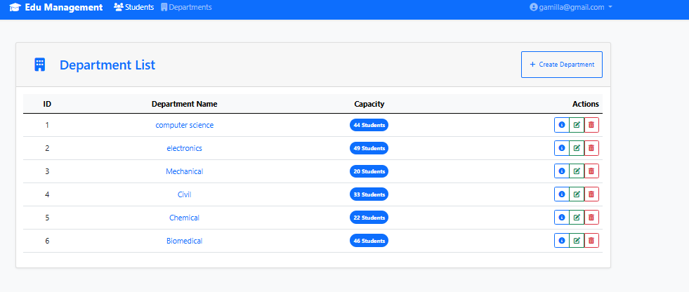
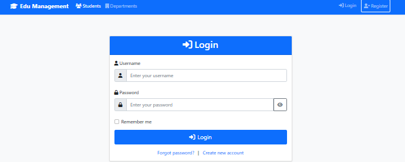
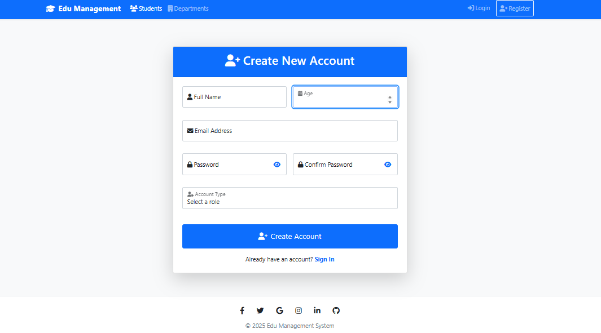

# EDU- Student Management System with Admin Dashboard

 


<div align="center">
  
  <p><em>Department Interface</em></p>
</div>

## 📝 Enhanced Overview

EDU is a comprehensive school management system featuring robust authentication/authorization and an admin dashboard, built with ASP.NET Core MVC.

## 🆕 Key Features

### 🔐 Authentication & Authorization
<div align="center">
  
  

</div>

- Role-based access control (Admin, Staff, Student)
- Secure password hashing
- Password reset functionality
- Session management

## 👥 Roles & Permissions

| Role       | Permissions | 
|------------|-------------|
| Admin      | Full system access |
| Staff      | Manage students | 
| Student    | View profile |

## 🛠️ Technology Stack

<div align="center">
  
  
  
</div>

## 🚀 Getting Started

### Prerequisites
- .NET 6.0 SDK
- SQL Server 2019+
- Node.js (for frontend dependencies)

### Installation
```bash
# Clone the repository
git clone https://github.com//ProjectX.git
cd ProjectX

# Install required packages
dotnet add package Microsoft.AspNetCore.Identity.EntityFrameworkCore
dotnet add package Microsoft.AspNetCore.Identity.UI

# Run migrations
dotnet ef database update

### 📄 License
MIT License - See LICENSE for details.

Developed with ❤️ by Donia